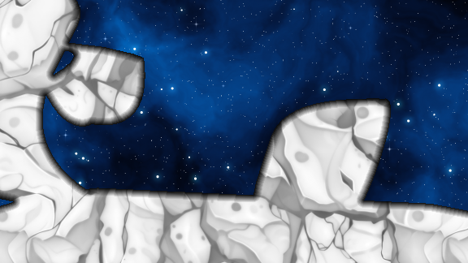
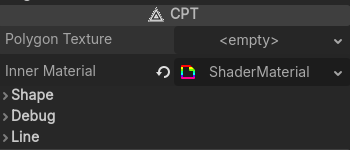
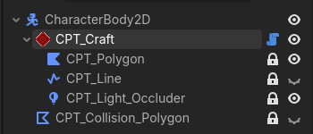
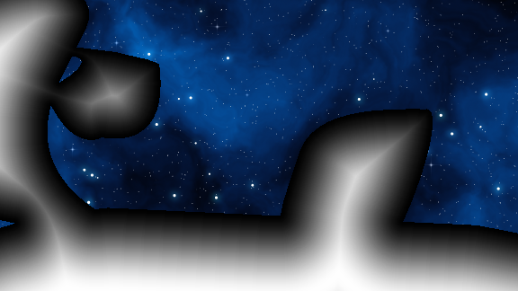
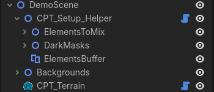

#  CustomPolygonTool
- It was made with the intent of reusing the already existing nodes in Godot.
- It have the goal to be customizable by the user.
- It adopt a new approach to mapping your material to your polygons.

##  CPT
> [!TIP]
> **Don't** instantiate it, it's only the base class, nothing will happen.
### Features

| Edit like always | |
|-|-|
|  | Use the regular polygon tools provided by Godot to edit the shape |

| Main Options | |
|-|-|
|  | The main categories available for you to edit and customize the shape and how it look. We'll dive int the Materials later |

###  CPT_Terrain
Create **how many** you want per scenes, create your shape, customize it by adding your own shader or modifying the existing one, and there you have a static ground !

###  CPT_Craft

> [!TIP]
> **Only one** per scene, it's used to be added as a child of an ObjectCollision2D (CharacterBody, StaticBody, AnimatableBody)

Add your own scripts to the parent, and customize his behavior !

## Material

- There is a lot of usefull options in the shader.
- I encourage you to test them out to see what they do !

### Features

#### Use the power of SDF
> Using the generated signed distance field from every [LightOccluder2D](https://docs.godotengine.org/en/stable/classes/class_lightoccluder2d.html#lightoccluder2d) by Godot.

Here, there is 4 different polygons, but yes, thanks to distance fields, they fit each others, and the outline stay where it need !

| SDF | Result |
|-|-|
|||

#### Map any images to your terrain
> Using a [BackBufferCopy](https://docs.godotengine.org/fr/4.x/classes/class_backbuffercopy.html#backbuffercopy)

| Like this | Not like this |
|-|-|
|  | 

| Scene setup| CPT_SetupHelper |
|-|-|
|  |You can quickly bring this setup in your scene by adding a CPT_SetupHelper **right under the root of the actual scene**|

- **ElementsToMix** : put in it the elements you want to mix with your terrain
- **DarkMasks** : put in it your dark masks to differentiate between elements and background
>[!TIP]
> Usually using color rects, but any will do !
- **ElementsBuffer** : will take care of saving the screen at this point in time and use that saved image latter in the [cpt_inner.gdscript](addons/custom_polygon_tool/materials/cpt_inner.gdshader)
>[!TIP]
> The order in wich Godot draw the objects is from top to bottom in the scene tree when objects have the same z_index
