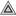

#  CustomPolygonTool
- It was made with the intent of reusing the already existing nodes in Godot.
- It have the goal to be customizable by the user.
- It adopt a new approach to mapping your material to your polygons.

###  CPT_Terrain
Create **how many** you want per scenes, create your shape, customize it by adding your own shader or modifying the existing one, and there you have a static ground !

###  CPT_Craft

- **Only one** per scene, it's used to be added as a child of an ObjectCollision2D (CharacterBody, StaticBody, AnimatableBody)
- Add your own scripts to the parent, and customize his behavior !

## Material
### Map any images to your terrain
| Like this | Not like this |
|-|-|
|  | 

